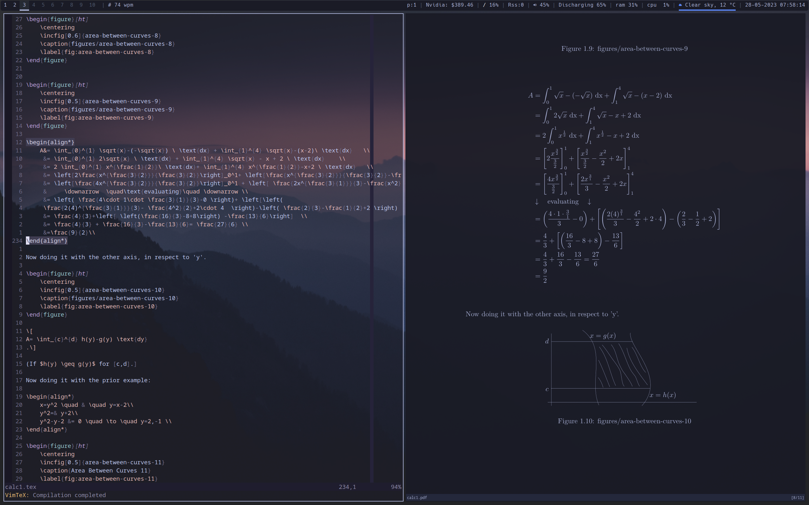

# Dotfiles

1. Excuse the mess

Those are my dotfiles for Arch/Asahi linux.

Some thing are not working too well, due to drivers missing but generally all
configs should universally work.

## Sources I got my configs from:

- 70% made oneself
- 25% stolen
- 05% made with chatgpt

## Programs
OS: Arch

WM: bwpwm

Terminal: alacritty

Texteditor: nvim

viewer: zathura

rss: newsboat

Shell: zsh

audio something: pipewire

## Pictures :)

# Shortcuts
## neovim

| Command | Description |
| --- | --- |
| `leader pv` | `directories` |
| `leader w` | `:w` |
| `leader q` | `:wq` |
| `leader l` | `:VimtexCompile` |
| `J` | `J but cursor stays` |
| `C-d` | `30 lines down` |
| `C-u` | `30 lines up` |
| `n` | `nzzzv` |
| `N` | `Nzzzv` |
| `leader p` | `paste copied line?` |
| `leader y` | `yanks into system clipboard` |
| `leader Y` | `dont know ` |
| `leader d` | `_d?` |
| `C-c` | `Escape` |
| `Q` | `<nop>?` |
| `leader f` | `get lsp for file format` |
| `C-k` | `cnext` |
| `C-j` | `cprev` |
| `leader k` | `lnext` |
| `leader j` | `lprev` |
| `leader x` | `chmod file` |
| `leader vvp` | `opens packer.lua` |
| `leader s` | `substitute word you're on` |
| `leader leader` | `:so` |
| `leader b` | `switch next buffer` |
| `leader d` | `delete current buffer` |

### plugins
| Command | Description |
| --- | --- |
| **Fugitive** |
| `Leader + gs` | `Git` |
| **Harpoon** |
| `Leader + a` | `mark add file` |
| `Control + e` | `ui-toggle menu` |
| `Control + h/t/n/s` | `navigate to file 1-4` |
| **LSP** |
| `S-Tab` | `select previous` |
| `Tab` | `select next` |
| `Enter` | `select confirm` |
| `C-Space` | `complete` |
| `gd` | `definition` |
| `K` | `hover` |
| `leader vws` | `workspace symbol` |
| `leader vd` | `diagnostics open float` |
| `[d` | `diagnostics goto next` |
| `]d` | `diagnostics goto prev` |
| `leader vca` | `code action` |
| `leader vrr` | `references` |
| `leader vrn` | `rename` |
| `C-h` | `signature help` |
| **Telescope** |
| `leader pf` | `find files` |
| `C-p` | `git files` |
| `leader ps` | `grep in file` |
| **Ultisnips** |
| `s-tab` | `expand snippet` |
| `C-d` | `jump forward` |
| **untotree** |
| `leader u` | `untotree` |
| **VimTex** |
| `leader fg` | `<Esc>:!inkscape-figures create figures/` |
| `leader efg` | `<Esc>:!inkscape-figures edit figures/` |
| **Codium** |
| `C-g` | `accept` |
| `C-;` | `cycle forward` |
| `C-,` | `cycle backward` |
| `C-x` | `clear` |
| **Obsidian** |
| `leader o b ` |`view backlinks`|
| `leader o t ` |`open todays note`|
| `leader o y ` |`open yesterdays note`|
| `leader o o ` |`open in obsidian`|
| `leader o n ` |`new note`|
| `leader o s ` |`search obsidian notes with telescope`|
| `leader o v ` |`quick switch notes`|
| `leader o L ` |`link somthing`|
| `leader o L n` |`make a new link`|
| `leader o f ` |`follow link`|
| `leader o t ` |`apply template with telescope`|

## sXhkd

| Command | Description |
| --- | --- |
| `super + esc` | `reload sxhkd` |
| `super + return` | `alacritty` |
| `super + r` | `rofi run` |
| `super + d` | `rofi app launcher` |
| `super + shift + d` | `rofi ssh` |
| `super + alt + 3` | `scrot monitor` |
| `super + alt + 4` | `scrot active window` |
| `super + w` | `firefox` |
| `super + shift + w` | `qutebrowser` |
| `super + n` | `newsboat` |
| `super + e` | `rofi fuzzy cd into documents` |
| `super + a` | `gcalcli calw` |

### note setup
| Command | Description |
| --- | --- |
| `alt + z` | `open pdf of current course` |
| `alt + shift + z` | `select course` |
| `alt + shift + c` | `compile all masters` |
| `alt + l` | `select how many lectures to view` |
| `alt + shift + l` | `select lecture to open in nvim` |
| `super + x` | `opens link defined by url: in course yaml` |

### bspwm
| Command | Description |
| --- | --- |
| `super + alt + q/r ` | `bspwm restart` |
| `super + q` | `quit bspc node` |
| `super + g` | `move active node to biggest window` |
| `super + t` | `active node tiled` |
| `super + s` | `active node floating` |
| `super + f` | `active node fullscreen` |
| `super + shift + h/j/k/l` | `focus node in west/south/north/east` |
| `super + p/b/,/.` | `node parent/brother/first/second` |
| `super + [/] ` | `switch desktop to prev/next` |
| `super + Tab` | `focus last desktop` |
| `super + o/i` | `idk` |
| `super + shift + 1-9,0` | `desktop 1-9,0` |
| `super + alt + h/j/k/l` | `expand node in chosen directions by 60` |
| `super + alt + shift + h/j/k/l` | `contract node in chosen directions by 60` |
| `super + left/down/up/right` | `move node in given direction by 60` |
